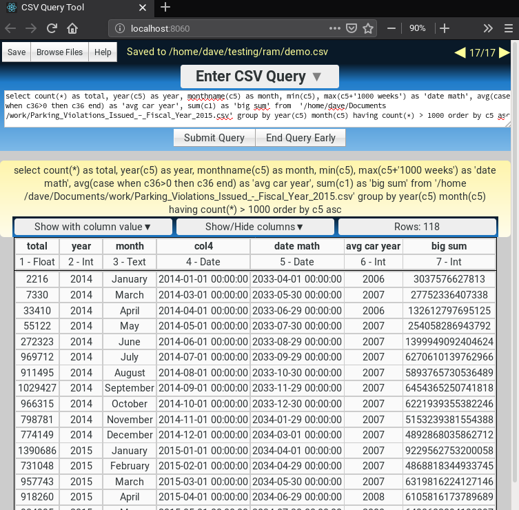

## csvtool

Beware all ye who enter. This codebase is an abomination that was written before I had any knowledge of Go or of how interpretters work, or any appreciation of loose coupling or best practices of any kind. The C++ version is better.

---

This is a csv query engine with a web-browser gui and a custom but incomplete implementation of SQL that makes querying big csv files easy.

Executable can be downloaded at davosaur.com/csv

Here's a demo of a few useful features in a pretty useless query:

---

MIT license
